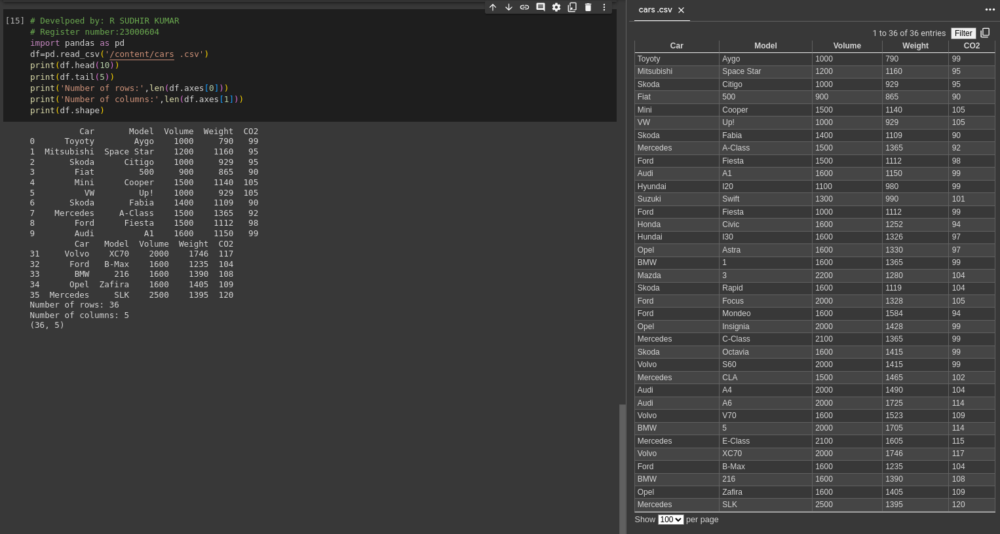

# Read-from-CSV

## AIM: 
To write a python program to read the contents from a csv file 
## ALGORITHM:
### Step 1:
Import pandas library 
### Step 2:
Read the csv file "cars.csv" using read_csv method and assign it to a variable
### Step 3:
Use head and tail method to get the required contents from the file 
### Step 4:
Use len() method to get the number of rows and columns and 'shape' attribute to find the dimensions of the dataframe and print the output
### Step 5:
End the program
## PROGRAM:
```python
# Develpoed by: R SUDHIR KUMAR
# Register number:23000604
import pandas as pd
df=pd.read_csv('/content/cars .csv')
print(df.head(10))
print(df.tail(5))
print('Number of rows:',len(df.axes[0]))
print('Number of columns:',len(df.axes[1]))
print(df.shape)
```
## OUTPUT:

## RESULT:
The program was successfully executed.